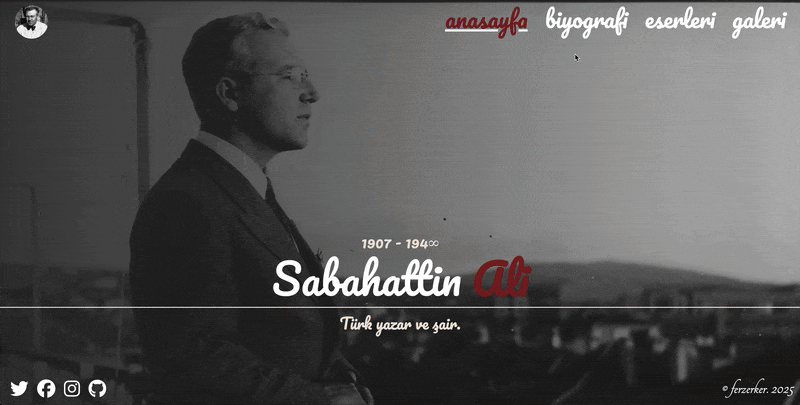

# Sabahattin Ali Project 📚



Bu proje, büyük Türk yazar ve şair Sabahattin Ali'nin hayatını, eserlerini ve mirasını tanıtmak amacıyla geliştirilmiş, modern ve bilgilendirici bir web sitesidir. Vanilla JavaScript ve SCSS kullanılarak, harici bir framework bağımlılığı olmadan (No-Framework) geliştirilmiştir.

## 🌟 Özellikler

*   **Biyografik Zaman Çizelgesi:** Yazarın doğumundan ölümüne kadar olan hayat hikayesinin kronolojik ve detaylı anlatımı.
*   **Eser Tanıtımı & Listeleme:** Romanlar, öyküler ve şiir kitaplarının görsellerle desteklenmiş kapsamlı listesi.
*   **İnteraktif Galeri:** Yazarın hayatından kesitler sunan, görsel odaklı fotoğraf galerisi.
*   **Dinamik İçerik Yönetimi:** Sayfalar arası akıcı geçişler ve modern navigasyon yapısı.
*   **Responsive Tasarım:** CSS Grid ve Flexbox ile tüm cihazlarla (Mobil, Tablet, Masaüstü) uyumlu arayüz.

## 🛠 Kullanılan Teknolojiler ve Yöntemler

*   **Core:** HTML5, CSS3 (SCSS), JavaScript
*   **Styling:** BEM metodolojisi, SCSS (Sass) pre-processor.
*   **Assets:** Font Awesome (İkonlar), Google Fonts.
*   **Architecture:** Çok sayfalı yapı (Multi-Page Application).

## 📂 Proje Yapısı

```
/
├── css/            # Derlenmiş CSS dosyaları
├── img/            # Görsel materyaller (Fotoğraflar, Kitap kapakları)
├── js/             # Uygulama mantığı ve interaktif scriptler
├── scss/           # SASS kaynak dosyaları (Partials, Variables, Mixins)
├── index.html      # Ana Sayfa
├── about.html      # Biyografi Sayfası
├── projects.html   # Eserler Sayfası
└── gallery.html    # Galeri Sayfası
```

## 🚀 Kurulum

Proje statik dosyalardan oluştuğu için herhangi bir kuruluma (npm install vb.) ihtiyaç duymaz.
1. Projeyi indirin.
2. VS Code **Live Server** eklentisi ile `index.html` dosyasını açın.
*(Not: Dosyaların düzgün görüntülenmesi ve path sorunları yaşamamak için bir yerel sunucu kullanılması önerilir.)*
